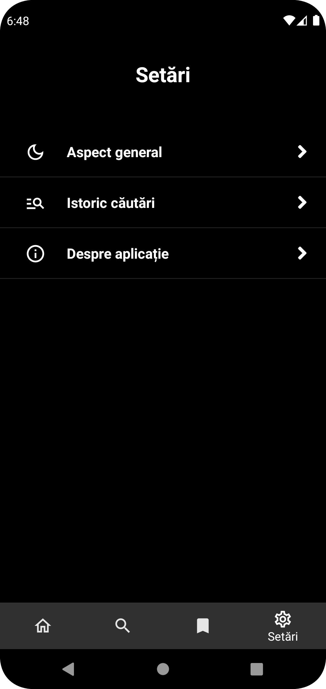

# DEX Online

## Description

An Android mobile application that utilizes the **dexonline.ro** API to provide users with the ability to search for and access definitions for words in the Romanian language. The app is structured into multiple tabs, including features such as word search, saving definitions, and personalized settings.

## Frames

- **Home**: The main landing page of the app, displays the "Word of the Day" and words of the same date from previous years.
- **Search**: Allows users to enter a word into a search field and receive definitions and related information for that word.
- **Saved Definitions**: A section where users can view and manage the list of previously saved definitions.
- **Settings**: Allows customization of preferences, including:
  - **Theme**: Choose between light and dark theme.
  - **Search History**: View and manage the history of searched words.
  - **About**: Some information about the application, its purpose, and the developer.
## Technologies Used

- Programming Language: Java
- APIs: dexonline.ro
- Android SDK

## Installation

1. Clone this repository to your local machine:

```bash
git clone https://github.com/ciprian-trandafir/dex-online-app.git
```

2. Open the project in Android Studio.
3. Connect an Android device or use an emulator to run the application.

## Screenshots




